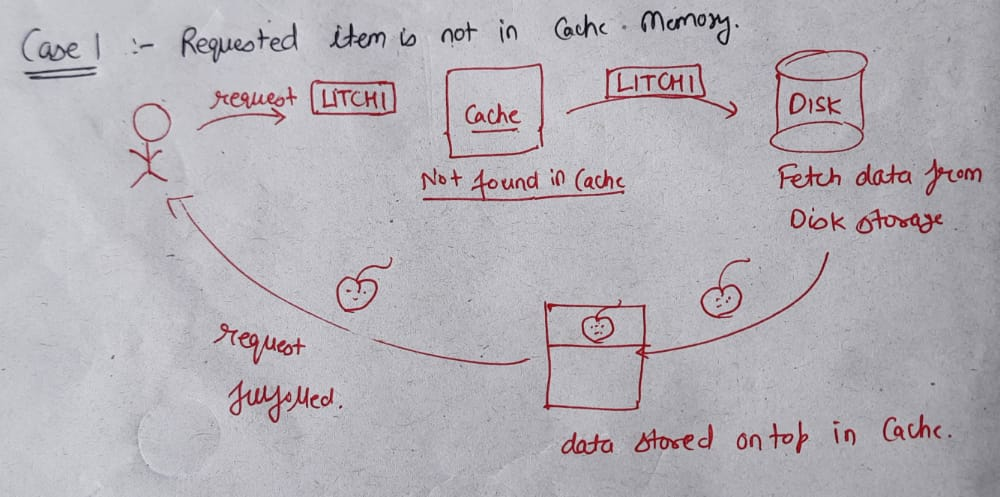
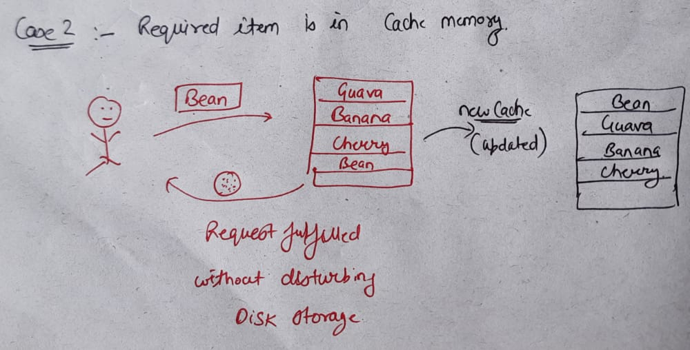
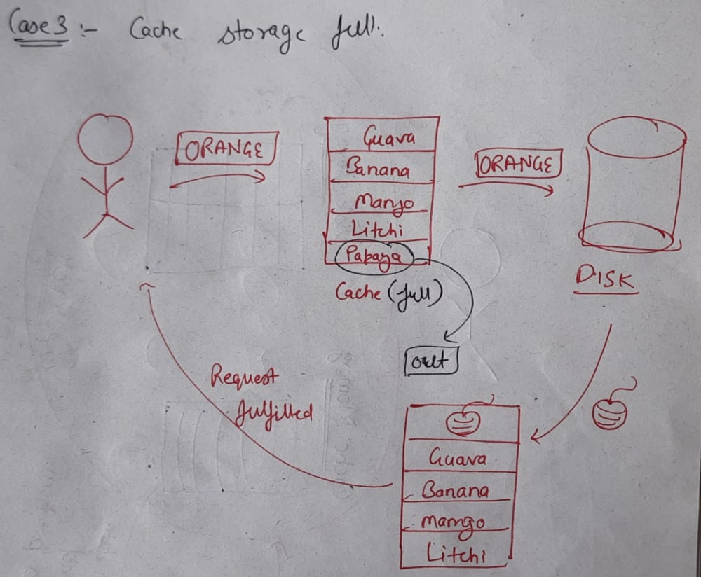

**LRU Cache**

:green_heart: A data structure that returns **Least Recently Used** items:

Let me explain with examples and some hand made diagrams :smiley:

Servers basically provides service in form of data to us (we are clients to a server). Basically we request our server to fetch details and if server
has that detail, it will provide us with a big smile :blush:. But think :open_mouth: how many request will be at server at every point of time, as you can imagine 
with world's population and user of Internet.

Now suppose it have only one memory from where it is fetching details to us, so eventually it will take a lot of time to complete our requests.

So to solve this problem servers have two type of memory :-

**1. Cache Memory**

**2. Disk Storage**


Now let there are 1000 requests 😧 and generally most of them are frequent like "open youtube" or "open github". and some are very rare requests like
"*send me 100 billion $*"... So our cache memory stores the requests which are most frequent and returns the request without disturbing the disk storage.
Hence it saves a lot of time to us and saves a lot of energy of fetching details from main disk storage..:smiley:

Now this LRU cache has a capacity of storing data...and let's understand the process with a flow diagram :blush:
<br>
<br>
<br>


:star2:**Case 1** : Cache doesn't have data about request from client.

So it will ask main disk storage and while returning from disk it will also save the same data in cache memory and return to client. See diagram below :relaxed:



<br>
<br>
<br>
:star2:**Case 2** : Requested item is in cache memory.

It's easy as the request will be fulfilled from the cache memory and disk storage is untouched



<br>
<br>
<br>

:star2: **Case 3** : Cache storage is full.

Now in this situation it will delete the least recently used item in the cache memory and fulfills the client request.



<br>
<br>
<br>
<br>

This whole idea is implemented by me in C++ code using **Linked List** and **Hashmaps** with 3 functions.

```
insertkeyvalue(key,value)
getvalue(key)
mostrecentkey()
```
